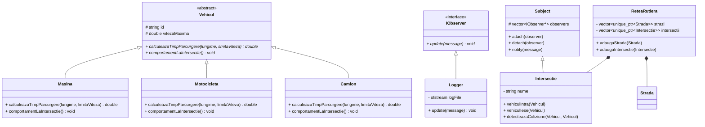

# Documentație Teoretică - Simulare Trafic Rutier

Acest document justifică opțiunile arhitecturale alese pentru rezolvarea Temei 3121A la materia Programare Orientată pe Obiecte (POO).

## 1. Concepte POO Utilizate

1. **Încapsulare:** Starea obiectelor (`Strada`, `Vehicul`) este păstrată privată, fiind accesibilă din exterior doar prin metode specifice de tip getter (`getNume()`, `getLungime()`). 
2. **Moștenire & Abstractizare:** Clasa `Vehicul` servește ca bază (interfață parțial abstractă) pentru toate tipurile de vehicule care pot fi simulate: `Masina`, `Motocicleta`, `Camion`. Metodele pure virtuale asigură că fiecare derivată se va comporta conform propriului standard.
3. **Polimorfism:** Când rețeaua dictează traversarea, ea folosește doar referințe/pointeri la `Vehicul`. Însă la runtime, metodele `calculeazaTimpParcurgere()` și `comportamentLaIntersectie()` se execută particularizat pentru fiecare instanță. Astfel, motocicleta este logic mult mai rapidă decât un camion chiar dacă apelul de bază este identic.
4. **Compoziție:** Clasa `ReteaRutiera` încapsulează strict elemente `Strada` și `Intersectie` prin `std::unique_ptr`, definind relația de "has-a" dictată de cerință. Rețeaua moare cu tot cu elementele de sub ea, definind compoziția pură.

## 2. Design Patterns

- **Observer Pattern:** Implementat via `IObserver` (`Logger`) și `ISubject` (`Intersectie` care moștenește un implementator de bază `Subject`).
  - *Motivare:* Permite ca intersecțiile să genereze loguri în consolă sau fișiere externe atunci când apar coliziuni sau tranzit, fără ca logica pură din clasa `Intersectie` să aibă cunoștințe (dependențe) despre sistemul de IO (Logger).

## 3. Diagrame UML

Mai jos regăsiți arhitectura structurii principale de clase modelată în Mermaid:

